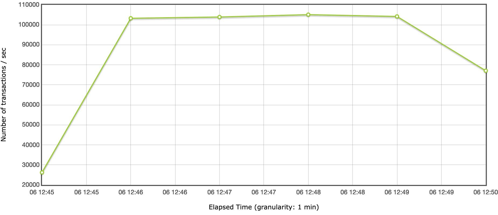

# Load testing

Running the load tests locally:

* Start `Demo.kt` at `localhost:8082`
* Make sure `jmeter` is installed: `brew install jmeter`
* Make sure JDK 8 is available:
  * eg `sdk install java 8.0.322-zulu`
  * Modify `jmeter` `JAVA_HOME` to use JDK 8
    * `atom /opt/homebrew/Cellar/jmeter/5.4.1/bin/jmeter`
    * eg: `JAVA_HOME="/Users/carrot/.sdkman/candidates/java/8.0.322-zulu"`
* Run standard load tests for 5 minutes: `./load-test.sh`

## Example TPS

Specs:
* macOS Monterey (12.0.1)
* MacBook Pro (14-inch, 2021) w/ M1 Max
* 20 clients, 5 minutes, 512mb-1024mb heap



## Using `oha`

You can run some simpler, faster load tests locally using [oha](https://github.com/hatoo/oha):
```
$ oha -q 100000 -n 1000000 http://localhost:8083

Summary:
  Total:	20.0007 secs
  Slowest:	0.0903 secs
  Fastest:	0.0000 secs
  Average:	0.0010 secs
  Requests/sec:	103331.5273
  
...
```
